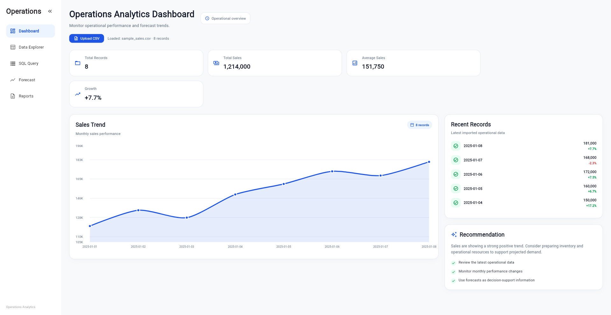
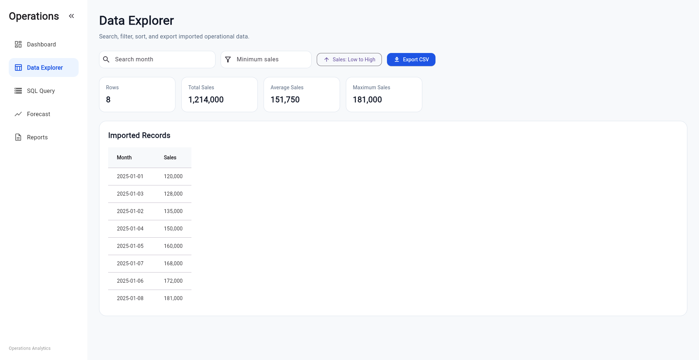
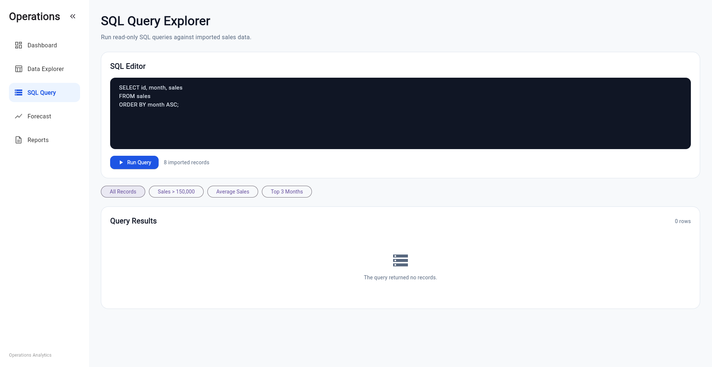
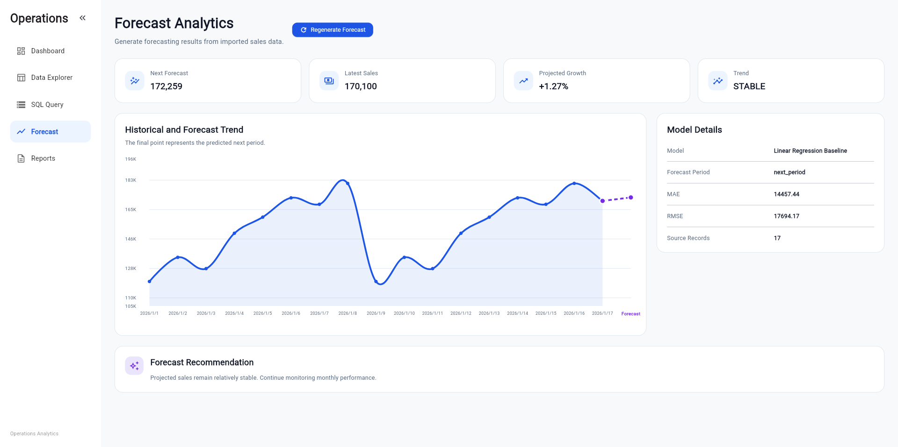
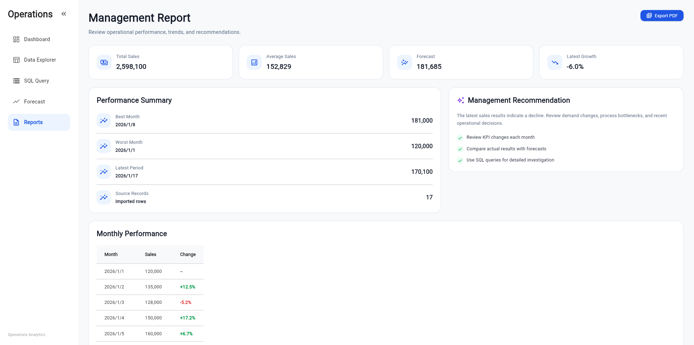

# Operations Analytics Platform

A full-stack analytics platform built with **Flutter**, **FastAPI**, **SQLite**, and **Python**.

The application allows users to upload CSV files, explore operational data, execute SQL queries, generate sales forecasts, and export management reports as PDF.

---

## Live Demo

🌐 Frontend: https://operations-analytics-dashboard.vercel.app

🚀 API Docs: https://operations-analytics-api.vercel.app/health/docs

❤️ API Health: https://operations-analytics-api.vercel.app/health

---

## Screenshots

### Dashboard



### Data Explorer



### SQL Query



### Forecast



### Report



---

## Features

- Upload and validate CSV files
- Responsive analytics dashboard
- Interactive KPI cards and sales trend chart
- Data search, filtering, sorting, and CSV export
- SQLite database integration
- Read-only SQL query explorer
- Python forecasting API with FastAPI
- Forecast metrics (MAE & RMSE)
- PDF management report export
- Responsive sidebar
- GitHub Actions CI

---

## Architecture

```text
          CSV Upload
               │
               ▼
        Flutter Web App
               │
     ┌─────────┼─────────┐
     │         │         │
     ▼         ▼         ▼
 Dashboard  SQLite   Data Explorer
     │         │
     │         ▼
     │    SQL Query
     │
     ▼
 FastAPI Forecast API
     │
     ▼
 Python Forecast Engine
     │
     ▼
 Forecast & PDF Report
```

---

## Tech Stack

| Category | Technology |
|----------|------------|
| Frontend | Flutter, Dart |
| Backend | FastAPI, Python |
| Database | SQLite |
| Charts | fl_chart |
| File Upload | file_picker |
| PDF | pdf, printing |
| Deployment | Vercel |
| CI | GitHub Actions |

---

## Project Structure

```text
lib/
├── app/
├── database/
├── models/
├── pages/
├── services/
├── theme/
└── widgets/

python/
├── api.py
└── forecast.py

api/
└── index.py

assets/
screenshots/
test/
```

---

## Run Locally

### 1. Install Flutter dependencies

```bash
flutter pub get
```

### 2. Start the FastAPI server

```bash
source python/.venv/bin/activate
uvicorn python.api:app --reload --host 127.0.0.1 --port 8000
```

### 3. Run Flutter Web

```bash
flutter run -d chrome
```

---

## Sample CSV

```csv
month,sales
2025-01,120000
2025-02,135000
2025-03,128000
2025-04,150000
2025-05,160000
```

---

## Future Improvements

- User authentication
- Docker deployment
- Advanced forecasting models (LSTM)
- Automated integration tests
- Multi-dataset support
- Role-based access control

---

## License

This project is intended for portfolio and educational purposes.


